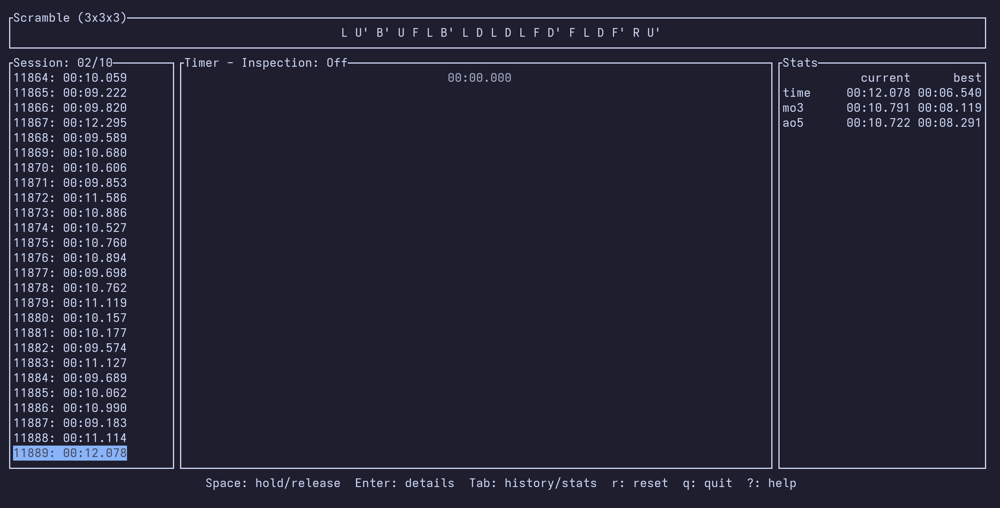

# cube-tui

[](https://crates.io/crates/cube-tui)

A terminal UI timer and session manager for speedcubing.



Out of the box, it's a lightweight TUI timer that lets you time solves, scramble, and check basic stats directly from
your terminal. All your session data is saved locally.

## Requirements

- [Rust & Cargo](https://rustup.rs/)
- [Bun](https://bun.sh/) (required for the `dashboard` feature)
- One of [Node.js](https://nodejs.org/), [Bun](https://bun.sh/), or [Deno](https://deno.com/) (required for the `wca-scrambles` feature)

## Installation & Features

You can install the app globally using Cargo. By default, it installs the core terminal app without any heavy
dependencies:

```sh
cargo install cube-tui
```

If you want extra functionality, you can enable specific features during installation depending on your setup.

### Dashboard

Spins up a local web server (localhost) with a companion app. This web UI can be used to look at your solve history and
advanced statistics.

To install with the dashboard included:

```sh
cargo install cube-tui --features dashboard
```

*Note: The build script will automatically use Bun to install dependencies and build the web frontend, embedding it
directly into the executable.*

### WCA Scrambles

Uses [cubing.js](https://github.com/cubing/cubing.js) scramble generation for WCA events (instead of the built-in
random generator).

To install with WCA scrambles support:

```sh
cargo install cube-tui --features wca-scrambles
```

When this feature is enabled, cube uses WCA API scrambles by default. If the local scrambles app cannot be started,
it automatically falls back to the built-in random generator.

### Bluetooth

Allows the app to connect directly to Bluetooth Low Energy (BLE) timers. Right now, only the GAN timer is supported.

To install with Bluetooth support:

```sh
cargo install cube-tui --features bluetooth
```

### All Features

If you want dashboard, Bluetooth timer support, and WCA scramble API support:

```sh
cargo install cube-tui --all-features
```

## Usage

Run the terminal app:

```sh
cube
```

To see all the commands run

```sh
cube --help
```

If you installed from source, you can also run it directly from the project root:

```sh
cargo run --release
```

If you installed with the `dashboard` feature, the command:

```sh 
cube dashboard
``` 

will start the app with dashboard support
enabled.

Use a custom port if needed:

```sh
cube dashboard --port 8080
```

The default port is `7799`.
